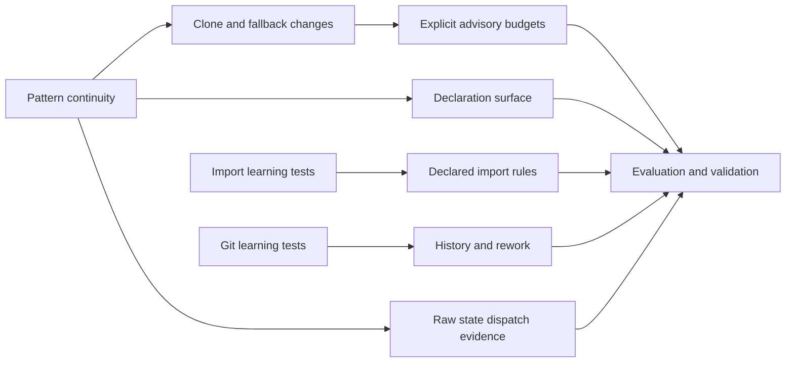

# Change-specific engineering evidence

Status on 2026-09-21: the implementation slices below are available in the source
checkout. Integrated tests, static checks, and distribution checks passed. The
final working-tree check follows the documentation commit. This is not a release or
a validation of defect probabilities.

The work extends existing source discovery, comparisons, detectors, and report
contracts. New evidence stays separate from calibrated snapshot scores. Tests
have separate authors from the implementations they specify.

## Delivery status

| Slice | Delivered behavior | State |
|---|---|---|
| TB-1: Pattern continuity | `review_change(ComparisonRequest)` and `slop changes` preserve introduced, removed, persisted, changed, and unresolved pattern evidence. | Implemented; final validation underway |
| TB-2: Clone and fallback changes | Clone member continuity exposes expanded/contracted groups. Existing exception-fallback candidates retain change relationships and handler coverage. | Implemented; final validation underway |
| TB-3: Advisory budgets | Explicit caps on introduced patterns, added clone members, and introduced fallback candidates. Enforced pass, exceeded, and incomplete outcomes remain distinct. | Implemented; final validation underway |
| TB-4: Novel surface | Source-bound Python declarations, file counts, conservative moves, and a derived novel declaration ratio. | Implemented; final validation underway |
| TB-5: Declared architecture | Static direct imports, forbidden module relationships, fan-out, and strongly connected components. | Implemented; final validation underway |
| TB-6: History and rework | Bounded first-parent Git history, exact source churn, recent line rework, and explicit partial traversal. | Implemented; final validation underway |
| TB-7: Evaluation and delivery | Independent controls, bounded HTTPX/Rich/Black observations, user documentation, and integrated checks. | Evaluation record and final commit review underway |
| User extension: Raw state dispatch | Source evidence for literal-string `.state` tests, with continuity and no score contribution. Shared enum outcome vocabulary and concrete variant dispatch in the new implementation. | Implemented; final validation underway |

## Scope and acceptance boundaries

### TB-1 and TB-2: Changes in existing evidence

`slop changes BASELINE CURRENT` uses the directory, pinned Git, `WORKTREE`,
language, and configuration semantics of `compare`. It retains source hashes,
locations, population ownership, diagnostics, and uncertainty. Exact-source
review validity remains independent of finding continuity.

The report owns `patterns`, `clones`, `errors`, and `state_dispatch` separately.
Pattern and error outcomes are introduced, removed, persisted, changed, or
unresolved. Clone group outcomes additionally distinguish expanded and contracted
groups. Member evidence makes an added third copy visible even when the original
clone group persists. Existing clone normalization remains authoritative.

Line shifts and supported syntax correspondence can preserve findings. Missing
or excluded source cannot establish a fix. Ambiguous identities, group changes,
and competing matches retain unresolved outcomes. Exception evidence comes from
the existing narrow literal-fallback detector. It does not infer the caller's
success contract or classify all fallback cascades.

The existing inventory reports some excluded files as aggregate language/cohort
counts without paths. An exclusion can therefore make all unmatched additions
and removals in that population unresolved. Supported matched relationships remain
comparable. These reports must not imply complete change counts when a population
has that coverage limit.

### TB-3: Explicit budgets

`slop changes ... --budget budget.toml` is advisory. Add `--enforce-budget` to
request an exit status based on the declared policy. The policy contains
`[[limits]]` entries with `metric` and nonnegative integer `maximum` fields.
Supported metrics are `introduced-patterns`, `added-clone-members`, and
`introduced-errors`. Each check keeps the source evidence behind its count.

Only declared metrics have caps. Unchanged debt does not consume an introduction
budget. Incomplete evidence takes precedence over a pass or exceeded result.
Exit codes are 0 for advisory completion or enforced pass, 1 for enforced exceeded,
2 for invalid input, and 3 for enforced incomplete or strict analysis failure.
`--enforce-budget` requires an explicit policy. Budgets do not score architecture,
history, declaration surface, or raw state dispatch.

### TB-4: Declaration surface

`slop surface BASELINE CURRENT` and `review_surface(ComparisonRequest)` count
classes, functions, async functions, methods, and nested declarations. Each source
occurrence owns a qualified name, kind, span, file hash, and exact AST fingerprint.
Names, literals, decorators, and annotations remain significant. Comments and
formatting do not change that fingerprint.

Outcomes are added, removed, modified, moved, unchanged, and unresolved. The novel
ratio is `added / (added + modified)`. It is unavailable for an empty denominator
or incomplete correspondence. Counts include nested declarations, so a method
change can also modify its containing class AST.

Unique exact syntax moves and Git rename hints support limited continuity.
Duplicate names, competing moves, possible declaration renames, and moves with
edits but no rename evidence remain unresolved. Failed or excluded counterpart
source cannot prove an addition or removal. Production/test moves stay separate
within their respective populations. No historical surface percentile is added.

### TB-5: Declared architecture

`slop architecture --root PATH --policy architecture.toml` uses explicit
`source_roots` and `[[forbidden]]` rules with dotted `source` and `target` module
names. Rules include descendants and apply to direct import edges. The same
graph supplies fan-out and cycles as strongly connected components.

The implementation parses source without importing target packages or executing
target configuration. Import Linter/Grimp learning tests identified execution
hazards in arbitrary target configurations and dotted package roots. Those paths
are outside this implementation. Clone ownership labels remain separate from
dependency permissions.

External packages are not resolved. Dynamic and star imports, ambiguous modules,
missing internal targets, and unresolved package members stay visible. Conditional
imports describe static source relationships. The command does not prove runtime
paths, enforce transitive layering, or fail because a violation is present.

### TB-6: Observed history

`slop history START END --repo PATH` reads the pinned first-parent range
`(start, end]`. Defaults are a 14-day recent-age window and a 100-commit limit.
Each step compares a commit with its first parent. Merged work counts once as
integration history. Added/deleted SLOC, churn, and net growth remain separate.

The line ledger records introductions inside the observed range. A later removal
can be recent, outside the age window, or unresolved. Anchor lines have unknown
introduction ages. Negative timestamp ages remain unresolved. Exact file renames
preserve known origins. Formatting and block moves can contribute to line churn.

Missing parents and commit limits produce partial traversal. Missing source
objects raise an input error. Failed parses preserve unavailable counts and
diagnostics. A shallow repository can still contain a complete requested range.
There is no overall rework percentage, future defect prediction, or churn score.
See [history research](history-evidence-research.md) for the observed Git behavior.

### User extension: Enum and raw state comparisons

`changes.state_dispatch` records direct raw-string tests against `.state` in
assertions, `if`, and `while` conditions. Supported operators are equality,
inequality, and membership/nonmembership in literal string collections.
Boolean combinations in those test expressions are included.

The detector does not infer receiver types. It excludes enum member comparisons
and concrete variant checks from this syntax candidate pattern. Review an enum
when values form one shared outcome vocabulary. Use a concrete variant check
when selecting payload fields from a union. Raw state evidence stays unscored
and outside the three budget metrics.

The new implementations use closed tagged unions for different payload shapes.
Shared outcome names use `StrEnum` members. Concrete payload dispatch uses type
checks where appropriate. Existing JSON strings remain unchanged. Pydantic
learning tests establish the `Literal[StrEnum member]` wire behavior.

## Evaluation and final validation

Independent tests cover positive controls, intentional keep cases, uncertain
matching, parser failures, provenance, imported-report checks, and CLI behavior.
Focused passing suites do not replace the full integrated validation gate.

The [bounded change evaluation](change-evidence-evaluation.md) inspects pinned
HTTPX, Rich, and Black pairs. It checks observed changes, retained evidence, and
explicit source limits. Public origins were verified before bounded parent
fetches. Slopmeter self-review and synthetic controls are reported separately.
The selected public changes do not supply an independently labeled introduced
defect. They do not estimate precision, recall, or maintenance risk. The evaluation
record owns the exact revisions, scope choices, observations, and final artifacts.

Delivery checks:

- [x] Full regression suite and required coverage threshold: 1,962 passed,
  four skipped, 93.25% coverage on Windows Python 3.12.14.
- [x] Learning and performance checks: 69 passed, one skipped.
- [x] Distribution checks: four tests passed for wheel and source distribution.
  Isolated installed command smoke checks passed for both artifacts.
- [x] Pyright and all five import contracts passed. Whole-repository Ruff and
  formatting passed for 240 files.
- [x] Source-only self-review and explicit report limits recorded in the checkpoint.
- [ ] Final working-tree and commit check after docs commit.

The [checkpoint](change-evidence-checkpoint.md) records validation details and
the deliberate source-selection limits of the self-review.

## Original research: implemented and remaining

This delivery implements the bounded slices above. It does not implement every
detector or inference proposed in the original research.

| Research area | Current status | Remaining work |
|---|---|---|
| Introduced duplication | Clone member and group changes implemented. | Broader structural/semantic similarity and calibrated actionability. |
| Repository reimplementation | Conservative clone evidence only. | Semantic purpose, type, call-context, and reuse inference. No probability model. |
| Architecture inconsistency | Declared direct import rules, fan-out, and cycles implemented. | Transitive/layer policy, lifecycle/configuration/schema coherence, richer coupling. |
| Solution surface | Raw Python declaration/file changes and novel ratio implemented. | Historical change baselines, config/dependency surface, comparable change classes. |
| Error masking | Existing narrow literal exception fallback experiment now has change evidence. | Indirect cascades, success constructors, caller-contract analysis, wider control flow. |
| Abstraction inflation | Existing local trivial-wrapper rules remain. | Repository-wide single observed implementations, factories, strategies, adapters, and wrapper ratios. |
| Test quality and coupling | Existing cohorts/assertion complexity facts remain. | Mock/collaborator counts, interaction assertions, internal assertions, independent behavioral adequacy and mutation-result import. |
| Churn and rework | Bounded first-parent source churn and known-origin rework implemented. | Full-window survival analysis, block moves, longer history, calibrated maintenance associations. |
| Dependency/API anomalies | Not implemented. | Offline manifest/lock/import checks, version-specific APIs and deprecations, optional registry verification. |
| Dead or unused code | No new repository-wide detector. | Scope-aware static analysis or imported tool evidence. |
| Unnecessary configuration | No new detector. | Observed use/value counts and contextual review. |
| Coupled and derived state | Existing narrow experiments remain. Raw state-dispatch evidence added. | Cross-file weak-model repairs, Pydantic/TypedDict/alias support, richer invalidation semantics. |
| Cognitive complexity | Existing M4 remains cyclomatic-complexity based. | Separate nesting/cognitive erosion measure and calibration. |
| Model cohesion | Not implemented. | Field/method usage relationships and independently reviewed low-cohesion cases. |
| Change locality and maintenance coupling | File/declaration surface and bounded history supply partial facts. | Reuse relationships, files changing together, hotspots and historical baselines. |
| Comments, names, authorship style | Not added as new primary signals. | Keep weak stylistic evidence separate from engineering judgments. |

Semantic probabilities, arbitrary aggregate weights, and historical percentiles
remain research work. New scores require a broader independent labeled sample
and an evaluation split that was not used to tune the detectors.
