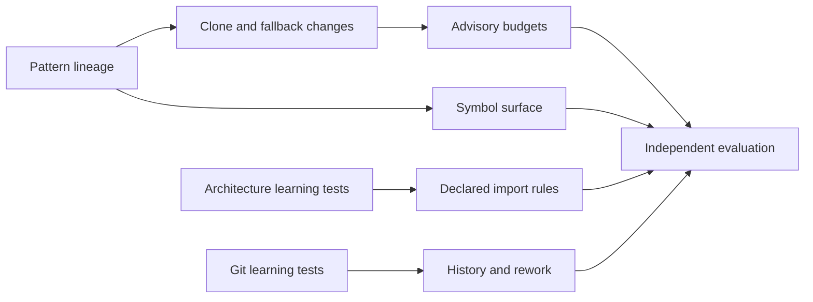

# Change-specific engineering evidence

The implementation extends existing source discovery, evidence, comparisons, and
review contracts. New measurements remain separate from calibrated scores.

The slices below define the delivery order and their owners. Each slice must pass
its independent behavior tests before dependent work starts.

| Slice | Architectural question | Size budget | Owner | State |
|---|---|---|---|---|
| TB-1 | Can existing pattern evidence retain continuity across two source states? | One finding family, directory and pinned Git input, one CLI command | Root + independent test author | In progress |
| TB-2 | Can comparisons expose new clone members and exception fallbacks? | Existing detectors only, member-level clone accounting | Assigned after TB-1 | Planned |
| TB-3 | Can explicit budgets evaluate introduced evidence without failing unchanged debt? | Raw count budgets, advisory default, explicit enforce flag | Assigned after TB-2 | Planned |
| TB-4 | Can source changes distinguish added symbols from edits and moves? | Python functions/classes, raw counts and ratios | Assigned after TB-1 | Planned |
| TB-5 | Can declared dependency rules produce source-bound violations safely? | Direct imports and declared forbidden relationships first | Architecture research agent, then separate test/implementation authors | Research |
| TB-6 | Can pinned Git history expose rework with an honest observation window? | One defined history policy, no predicted defect probability | History research agent, then separate test/implementation authors | Research |
| TB-7 | Can independent examples establish useful evidence and limits? | Reviewed positive/keep cases, coverage and review effort | Independent evaluation author | Planned |

The dependency graph keeps research parallel while implementation builds on
validated comparisons.



## TB-1: Pattern continuity

**Question answered:** Can a source change retain the identity of a pattern
finding while keeping exact-source review validity independent?

**Layers touched:** Existing providers and analyzer -> application comparison ->
owned change evidence -> public API -> CLI and JSON.

**Scope:** Add `review_change(ComparisonRequest)` and `slop changes BASELINE CURRENT`
with existing directory, `--repo`, `WORKTREE`, configuration, and language selection
semantics. Preserve ordinary scan/compare output. Use file pairs, source
correspondence, rule identity, and conservative matching. Ambiguous edits and
missing evidence remain unresolved.

The change union prevents a removed finding from carrying current evidence and
prevents an introduced finding from carrying baseline evidence. Counts derive
from the owned records. Source-bound review IDs remain unchanged.

```datamodel
name: PatternChange
store: immutable report
summary: Records one supported continuity relationship or unresolved candidates.
fields:
  - { name: state, type: "introduced | removed | persisted | changed | unresolved", required: true }
  - { name: occurrence ownership, type: tagged union, required: true, description: "Current only; baseline only; both; or candidate sets and reason" }
relationships:
  - { relation: owns, target: PatternOccurrence, cardinality: "1:N", description: Native finding plus language/cohort and source hash }
```

Validation criteria define completion.

- [ ] Added/deleted occurrences produce introduced/removed evidence.
- [ ] Line shifts, exact-content renames, and formatting-only edits preserve findings.
- [ ] Added duplicate occurrences retain multiplicity.
- [ ] Failed analysis, exclusions, and uncertain matches cannot manufacture fixes.
- [ ] JSON is deterministic, validates projections, and retains source identities.
- [ ] Git scans preserve checkout/index state and never execute target code.
- [ ] Existing scan/compare metrics and review validity are unchanged.

**Dependencies:** None.

## TB-2: Clone members and exception fallbacks

**Question answered:** Can existing detectors expose change-specific relationships
without repeating their detection logic?

**Layers touched:** Retained snapshots/source -> existing clone/error detectors ->
change evidence -> API/CLI.

**Scope:** Compare clone members as well as groups. Run the existing error detector
against retained Python documents, including pinned Git blobs. Preserve handler
coverage. New clone membership must remain visible when the group already existed.

- [ ] Adding a third copy reports one added member of an existing group.
- [ ] Copying a previously unique implementation creates a group with clear evidence.
- [ ] Removing one copy differs from removing all duplication.
- [ ] Error fallbacks retain supported/unsupported distinctions on both sides.
- [ ] Group splits, ambiguous moves, and normalization changes stay explicit.

**Dependencies:** TB-1.

## TB-3: Advisory budgets

**Question answered:** Can a policy act on introduced evidence while preserving
incomplete analysis as its own outcome?

**Layers touched:** Change report -> budget evaluation -> CLI exit status/JSON.

**Scope:** Explicit nonnegative count budgets for introduced patterns, added clone
members, and introduced fallback candidates. Default output is advisory. Explicit
enforcement returns documented success, exceeded, and incomplete outcomes.

- [ ] Unchanged debt does not exceed an introduced-evidence budget.
- [ ] Each exceeded budget links to the source findings used in its count.
- [ ] Incomplete assessment cannot return a clean enforced result.
- [ ] No new metric weight, percentile, or score formula is introduced.

**Dependencies:** TB-2.

## TB-4: Novel surface

**Question answered:** Can Python symbol changes distinguish new surface from
extension of existing code using the same selected sources?

**Layers touched:** Python AST -> symbol evidence -> file matching -> change report.

**Scope:** Count functions, async functions, and classes, with explicit nested-scope
identity. Report added/modified/deleted/moved/unchanged/unresolved symbols, added and
modified files, and a defined novel-symbol ratio. Keep counts unscored.

- [ ] Formatting and comments do not count as changed behavior-bearing AST.
- [ ] Exact structural moves and ambiguous matching have explicit outcomes.
- [ ] Empty populations produce an unavailable ratio, not invented zero evidence.
- [ ] Failed files and unsupported languages retain coverage limits.

**Dependencies:** TB-1.

## TB-5: Declared architecture

**Question answered:** Can existing tools supply safe source-located dependency
evidence, or does a bounded source-only resolver fill a demonstrated gap?

**Layers touched:** Source inventory -> import evidence -> declared policy -> report.

**Scope:** Research Import Linter/Grimp first. Never import target packages. Keep
ownership labels distinct from dependency permissions. First implementation
supports explicit source roots, direct imports, and forbidden module relationships.
Unsupported dynamic relationships remain unresolved.

- [ ] Learning tests settle source execution, module resolution, and locations.
- [ ] Allowed and forbidden fixtures exercise real declarations and source paths.
- [ ] Relative imports, unknown imports, and excluded modules have defined treatment.
- [ ] Cycles and fan-out derive from one graph where supported.
- [ ] No online resolution is added to normal scans.

**Dependencies:** Architecture research, independent test contract.

## TB-6: History and rework

**Question answered:** Can reproducible Git evidence distinguish churn, recent
rework, and unavailable history?

**Layers touched:** Pinned Git objects -> historical line evidence -> API/CLI.

**Scope:** Establish a bounded observation policy before implementation. Record
resolved endpoints, window, merge policy, rename handling, and completeness. Treat
later rework as observed history, never as knowledge available at the original PR.

- [ ] Zero net growth can still have nonzero churn.
- [ ] Recent changed/deleted additions count under the documented window.
- [ ] Formatting and renames cannot silently inflate semantic claims.
- [ ] Shallow or unavailable history is explicitly incomplete.
- [ ] Target source never executes and the checkout remains unchanged.

**Dependencies:** Git research, independent test contract.

## TB-7: Evaluation and delivery

**Question answered:** Do the new reports identify actionable review work with
visible uncertainty outside their implementation fixtures?

**Layers touched:** Reproducible cases -> reports -> independent review -> documentation.

**Scope:** Separate synthetic controls, self-review, and held-out public changes.
Retain positive and intentional keep cases. Do not infer precision/recall from
zero findings. Report supported coverage, unresolved reasons, label provenance,
and reviewer effort before considering score calibration.

- [ ] Independent tests precede each implementation and remain separately authored.
- [ ] Focused tests, full suite, Ruff, Pyright, and architecture contracts pass.
- [ ] Distribution checks cover new public entry points.
- [ ] User documentation states commands, output meanings, limits, and exit codes.
- [ ] Final review checks reuse, state shapes, source safety, and change size.

**Dependencies:** TB-1 through TB-6.

## Deferred scoring and semantic claims

Semantic reimplementation probabilities, arbitrary aggregate weights, and
historical percentiles remain research work. This delivery establishes the
deterministic evidence and evaluation needed to justify them. Single observed
implementations, broad catches, and large changes are measurements whose quality
interpretation depends on context.
