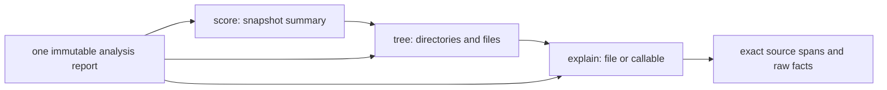

# Output and CLI direction

This document replaces the presentation mockups and command vocabulary in the
original design. It follows the user's [shared discussion](https://chatgpt.com/share/6aacd885-7c24-83e8-bc3c-aaf72a1c65f3)
and the instruction to keep the current application name. The metric definitions,
calibration requirements, language boundaries, and deterministic report remain in force.

## Reading order

The default view should let a reader identify the measured condition of a project
and locate a file to review. It should not require reading analyzer identifiers or
the complete evidence inventory.

1. Show the target and a compact headline. Say `lower is better` for slop scores.
2. Separate analysis completion from score availability. A missing score does not
   hide measured M2 or M4.
3. Show available measurements first, with explicit units and proportional bars.
4. Keep production and tests separate. Production remains the primary population.
5. Show a bounded file breakdown with paths and the metric used to rank it.
6. Put unavailable values and short reasons in a secondary section.
7. Keep detailed counts, mass, thresholds, and provenance in `--verbose` and
   `explain`. JSON remains complete and independent of terminal selection.

The current pattern fixture supplies a concrete raw-output example. These numbers
come from the TB-3 fixture; the layout is the next slice's target, not shipped output.

```text
slop.measure  tests/fixtures/patterns
Score unavailable · raw measurements available

Production · Python · 2 files · 4 SLOC
  Pattern verbosity  25.0%  [#####---------------]  1 / 4 SLOC

Files                                      Patterns     Erosion
  overlap.py                                100.0%          —
  clean.py                                    0.0%          —

Not measured
  Clone verbosity  not supported yet
  Erosion          no callables

2 findings · use explain for source evidence
```

Coverage uses `analyzed`, `partial`, or a specific source-error notice in human
output. Do not call a population `scored` when it has no calibrated score. A
legitimate not-applicable result, such as no callables, is distinct from a failure.
The existing coverage schema can remain compatible while the renderer improves its labels.

## Visual rules

These rules apply to summaries, file rows, tree views, and later comparisons.

| Value | Display | Meaning |
|---|---|---|
| Raw M2 or M4 ratio | Percentage plus proportional bar | Measured fraction, not calibrated points |
| Calibrated score | Value `/100` plus bar | Lower detected slop relative to its named profile |
| Unavailable | Em dash or ASCII `-`, with reason | No measured value and no bar |
| Measured zero | `0.0%` or `0.0/100`, with empty bar | A real measurement |
| Comparable M2/M3/M4 or score increase | Signed delta plus `worse` | More measured slop under compatible definitions |
| Comparable decrease | Signed delta plus `better` | Less measured slop under compatible definitions |
| M1 growth | Signed source-line change | Size change; not automatically a quality regression |

Use a neutral accent for raw bars. Derive calibrated score colors and bands from
the compatible calibration profile. Do not adopt the shared mockup's arbitrary
20-point bands as a new scoring model. Keep labels and signs readable without color.

`--color auto|always|never` controls ANSI output. `auto` respects `NO_COLOR` and
disables ANSI for redirected output. Explicit `always` overrides the environment.
Keep `--no-color` as an alias for `never`; reject an explicit conflict with
`--color always`. `--ascii` uses plain bars and tree connectors. Narrow views remove
secondary columns before wrapping paths. `--top N` bounds default detail without
truncating JSON.

## Command map

Command names describe the user's question. Existing shipped behavior remains
available while the new presentation is introduced.

| Command | Purpose | Delivery |
|---|---|---|
| `slop score [DIRECTORY]` | Compact snapshot summary and file breakdown | TB-3a; same scan pipeline and report |
| `slop scan [DIRECTORY]` | Compatibility entry point | Retained with the same options and report |
| `slop tree [DIRECTORY]` | Directory structure with raw file M2/M4 columns | TB-3a; unmeasured directory values stay absent |
| `slop explain FILE --root DIRECTORY` | Exact findings, callable evidence, and reasons | TB-3a; current snapshot evidence |
| `slop explain FILE --root DIRECTORY --symbol NAME` | Callable span, CC, SLOC, mass, and overlapping findings | TB-3a; no fabricated callable score |
| `slop compare BASE CURRENT` | Directory or Git comparison | TB-6/TB-7; replaces planned `diff` vocabulary |
| `slop findings` and `slop rules` | Full filtered evidence and catalog queries | TB-8 |
| `slop trend` | Compatible measurements across selected Git history | Follow-up after Git comparisons and version policy |

`explain --root` defaults to the current directory. File selectors resolve inside
that analysis root. `--symbol` uses the existing qualified callable name; duplicate
names need a source-line selector or a clear ambiguity error. It must not silently
pick the first declaration. Explicit options avoid ambiguous Windows drive colons.

The hierarchy describes navigation through one report. It does not define score
averaging or claim that callable-level calibration already exists.



Directory metrics added later must aggregate underlying source-line unions and
callable mass. They must not average file percentages or scores. Symbol views show
existing evidence until a separate scoring contract and calibration population exist.

## TB-3a scope and gate

This slice asks whether one report can support a compact summary, a file tree, and
evidence drill-down with one consistent visual format. It adds presentation and
report queries only. It adds no detector, calibration profile, history storage,
directory score, or symbol score.

- [ ] `score` and `scan` return equivalent full JSON for the same input.
- [ ] Summary and tree values reconcile exactly with file and cohort report metrics.
- [ ] Overlapping findings remain separate evidence while M2 counts each line once.
- [ ] Tree and explain views preserve production/test ownership and source errors.
- [ ] No score or bar converts unavailable into zero or raw percentages into points.
- [ ] File and callable explanation finds every relevant report record.
- [ ] Unknown paths and ambiguous callable names produce direct errors.
- [ ] Color auto/always/never, `NO_COLOR`, ASCII, redirection, and narrow widths have
  independent golden or contract tests.
- [ ] Existing JSON consumers and `scan` commands remain compatible.
- [ ] All current quality gates pass before TB-4 starts.

Comparison and trend examples in the shared discussion remain design references.
They do not introduce coupling, comment-volume penalties, changed-code scores,
mixed production/test headlines, or automatic fixes into the current metric model.

## Git source selection

Git support keeps paths and revisions separate so Windows drive names remain
unambiguous. `score`, `scan`, and `tree` accept `DIRECTORY --rev REVISION`.
`compare BASE CURRENT --repo DIRECTORY` treats both positional selectors as Git
revisions. `CURRENT` can be `WORKTREE` to read current local files. Without
`--repo`, the two comparison arguments remain directory paths.

The repository's current configuration applies to both Git inputs. JSON records
resolved commit IDs. The [Git source contract](git-design.md) defines object reads,
rename matching, and the read-only validation gate.
