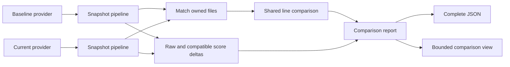

# Comparison data contract

This extends the approved snapshot report for TB-6 and TB-7. `compare` is the
public command, as recorded in [cli-output.md](cli-output.md).

> [!NOTE]
> Baseline and current results stay complete snapshots. Comparison records refer
> to their paths. They do not replace source facts or average file scores.

## Owned changes

Each comparison cohort owns `changes`, ordered by its current path when present,
otherwise its baseline path, then baseline path and kind. A tagged file pair
records five normal states plus an explicit unreadable-content state:

| Kind | Required paths | Meaning |
|---|---|---|
| added | current | No baseline member |
| deleted | baseline | No current member |
| unchanged | baseline and current | Same path and complete source content |
| modified | baseline and current | Same path with changed content |
| renamed | baseline and current | Different paths, paired by content or Git metadata |
| unresolved | equal baseline and current paths | At least one side's bytes could not be read |

Directory matching pairs equal paths first. It then pairs equal content among
unmatched paths, in lexical order. Hashes narrow candidates; full content equality
confirms each match. A file belongs to at most one pair. Matching stays within
one language and cohort. A production-to-test move is a deletion and an addition
in the respective cohorts.

Each file change owns a measured or unavailable line delta. The measured variant
stores exact added current-line numbers and deleted baseline-line numbers.
`added`, `deleted`, and `net` are checked projections of those sets. It must satisfy
`net = current SLOC - baseline SLOC`. An absent side contributes zero SLOC; a
failed parse remains unavailable. Project M1 sums complete file deltas and becomes
unavailable if any required file delta is unavailable.

Diff complete byte-line sequences, then intersect changed ranges with each side's
owned SLOC set. Also compare SLOC membership for aligned equal lines. This handles
source lines that become docstring-only, or the reverse, without changing their
text. Use one implementation for directories and Git. Exact renames have no line
change. Do not infer that positive size change means worse quality.
Exact renames with failed source parsing remain unavailable. Normalize CRLF and
CR line terminators for line comparison and ignore a final newline difference;
do not decode source bytes in the language-neutral diff core. Directory rename
identity still requires exact complete bytes. Disable heuristic auto-junk line
matching so repeated lines do not silently change the diff policy.

## Metric changes

File and project deltas refer to the M2, M3, combined verbosity, and M4 results in
their two owned snapshots. A measured delta is current minus baseline in the
same unit. Missing files, unavailable input metrics, or incompatible metric
definitions have explicit unavailable states. Added or deleted files do not
receive fabricated zero baseline ratios. Score differences require the same
profile and score model on both sides.

Diagnostics, findings, clone groups, and coverage retain source-side ownership.
Comparison assembly prefixes report IDs by side and updates diagnostic links.
It preserves each side's paths, exact evidence, metric results, and scores.

The Python contract lives in `domain/changes.py`:

```datamodel
name: FileChange
store: ComparisonCohortReport.changes
summary: One paired change with exact line evidence and derived metric deltas.
fields:
  - { name: pair, type: FilePair, required: true, description: AddedFile or DeletedFile or ModifiedFile or RenamedFile or UnchangedFile or UnresolvedFile }
  - { name: lines, type: LineDelta, required: true, description: MeasuredLineDelta or UnavailableLineDelta }
  - { name: deltas, type: tuple[MetricDelta], required: true, description: Unique metric IDs for comparable or unavailable changes }
```

Pair fields are `baseline_path` and `current_path`; absent-side fields do not
exist on added/deleted variants. Equal-path variants require equal paths;
renames require different paths. Measured line deltas contain `baseline_sloc`,
`current_sloc`, `added_lines`, and `deleted_lines`. Line sets contain sorted unique
positive line numbers. Counts `added`, `deleted`, and `net` are checked computed
projections. The stored SLOC totals must agree with the report's owning files.
Unavailable line deltas carry an existing `UnavailableReason`.

Growth is a measured finite ratio `net / baseline_sloc` when baseline SLOC is
positive. A zero baseline, including a zero-to-zero change, has explicit
unavailable growth with reason `no-baseline-sloc`. Never emit infinity or invent
a zero growth rate. The project comparison owns `line_delta` as
`MeasuredLineTotals` or `UnavailableLineDelta`. Measured totals contain
`baseline_sloc`, `current_sloc`, `added`, and `deleted`; checked computed `net`
and `growth` use the same rules as file deltas. Validate these totals against
all file changes and both owned snapshots.

`MeasuredMetricDelta` contains `metric_id`, finite `value`, and unit `ratio`,
`lines`, or `points`. `UnavailableMetricDelta` contains `metric_id` and one of
`missing-baseline`, `missing-current`, `unavailable-input`, or
`incompatible-definitions`. Their `state` discriminator is measured/unavailable.
The score delta uses metric ID `snapshot.score` and unit `points`.

`ComparisonCohortReport.deltas` contains project metric and score changes.
Its existing `metrics` field contains measured or unavailable `m1.loc-delta`.
For measured M1, the line-unit raw value is net, numerator is added SLOC, and
denominator is deleted SLOC. This is not a ratio. Snapshot M1 remains unavailable.
Report validation checks unique complete path pairing, line membership, net
reconciliation, and delta agreement with the source results.
Assembly requires equal tool, configuration, and adapter provenance because the
report envelope has one shared provenance record. Common metric versions must
agree. A failed adapter can omit version records only for unavailable metrics;
assembly retains the union of known versions. Every measured input must name its
version. The service uses one resolved configuration, registry, and calibration
profile for both sides. It rejects real definition conflicts while preserving a
failed side's evidence and diagnostics.

## Source pipeline



Keep source documents with their completed snapshot inside application
orchestration. Do not re-read a directory after analysis to calculate its delta.
Git providers resolve revisions and read objects without checkout mutation.
Git rename metadata can pair changed-content renames; it uses the same line
comparison and snapshot pipeline as directory pairs.

The terminal view shows both project scores when comparable, signed raw deltas,
M1 added/deleted/net lines, and the largest comparable regressions. `--top` and
`--scope` change display only. JSON preserves both complete source states and all
changes. M1 has no calibrated change-pressure score in this release.
