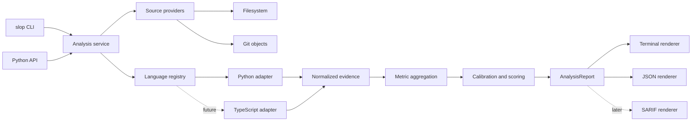

# Python Slop Detector Design

**Spec**: `.specs/python-slop-detector/spec.md`
**Status**: Approved

## Output Experience

The terminal report follows a progressive-disclosure model. The default view answers
four questions in order: what was analyzed, how bad is it, why did it receive that
score, and where should the user look first.

> [!IMPORTANT]
> A higher slop score always means more detected slop. Every terminal view states
> `higher is worse` next to the score. The tool does not invert the meaning into a
> health score.

### What the reference screenshots get right

| Reference feature | Decision |
|---|---|
| Headline 0-100 score | Keep |
| Scoring and rule versions | Keep |
| Analysis completeness | Keep |
| Production and test separation | Keep |
| Score contributions tied to raw metrics | Keep |
| Ranked hotspots with source spans | Keep |
| Long flat metric dump in the default view | Move behind `--verbose` |
| Safeguard configuration in the code report | Keep separate from slop scoring |

### Default snapshot report

The default report is short enough for a terminal and preserves the raw numerator
and denominator for every ratio:

```text
$ slop scan .

slop.measure · .
snapshot slop 54/100 · moderate · higher is worse
complete · Python · profile py-2026.1 · rules py-0.1 · 1.8s

source coverage
  production   128 files   18,420 SLOC   scored
  tests         74 files   12,880 SLOC   reported separately
  excluded      19 files                 generated, vendor, configured
  unsupported    3 files                 not analyzed

score contributions
  verbosity     32 pts   0.241   4,439 / 18,420 unique SLOC
    patterns             0.176   3,242 / 18,420 SLOC
    clones               0.103   1,897 / 18,420 SLOC
  erosion       22 pts   0.418   27 / 604 functions above CC 10
  ──────────────────────────────────────────────────────────
  snapshot      54 pts

change pressure
  unavailable            no baseline supplied
  run: slop diff . --base <revision-or-directory>

hotspots
  score  file                         primary reason
     91  src/parser.py                erosion 0.88 · CC max 31
     83  src/config/loader.py         patterns 0.36 · 18 findings
     77  src/render.py                clones 0.29 · 4 groups
     69  src/service.py               erosion 0.51 · CC max 17
     65  src/models.py                patterns 0.22 · 9 findings

findings
  126 pattern findings · 31 clone groups · 27 eroded functions
  run: slop inspect <file>       show file evidence
       slop findings             list all findings
       slop scan . --json        emit the complete report
```

Pattern and clone ratios do not add up to combined verbosity. Their source-line
sets can overlap. The contribution uses their union.

### Comparison report

A comparison presents movement before it presents the current snapshot. Positive
score deltas use the word `worse`, while negative deltas use `better` so that color
is never the only signal:

```text
$ slop diff . --base origin/main

slop.measure · . · origin/main → working tree
snapshot slop 47 → 54  +7 worse · higher is worse
change pressure 62/100 · high
complete · Python · profile py-2026.1 · rules py-0.1 · 2.4s

change summary
  M1 LOC delta              +412 net   +560 added   -148 deleted
  M2 pattern verbosity      0.162 → 0.176   +0.014 worse
  M3 clone verbosity        0.091 → 0.103   +0.012 worse
  combined verbosity        0.221 → 0.241   +0.020 worse
  M4 erosion                0.376 → 0.418   +0.042 worse

largest regressions
  delta  file                         cause
    +18  src/config/loader.py         12 new pattern findings
    +11  src/parser.py                function parse() CC 18 → 31
     +8  src/render.py                74 new cloned SLOC

resolved
  6 pattern findings · 1 clone group · 2 eroded functions

run: slop inspect src/parser.py --base origin/main
```

### File detail report

The file view shows evidence in source order after the summary. It does not repeat
project-wide metrics:

```text
$ slop inspect src/parser.py --base origin/main

src/parser.py
snapshot slop 91/100 · high · +11 worse
351 SLOC · 14 functions · 96 flagged SLOC

measures
  M1 LOC delta             +86 net
  M2 patterns             0.194   68 / 351 SLOC   12 findings
  M3 clones               0.128   45 / 351 SLOC    3 groups
  combined verbosity      0.274   96 / 351 unique SLOC
  M4 erosion              0.881   4 / 14 functions above CC 10

eroded functions
  lines     CC   SLOC    mass    function
  21-173    31    109   323.8    parse
  188-264   18     61   140.6    normalize

pattern findings
  42:9-44:31   redundant-else-after-return
  78:5-86:22   defensive-fallback-chain
  194:5-205:18 trivial-wrapper

clone groups
  clone-17   24 SLOC   this file:118-145   also src/legacy_parser.py:91-118
  clone-29   11 SLOC   this file:276-289   also src/reader.py:55-68
```

## Command Views

| Command | Purpose | Default detail |
|---|---|---|
| `slop scan PATH` | Score one snapshot | Summary and top five hotspots |
| `slop diff PATH --base BASE` | Compare two states | Deltas and largest regressions |
| `slop inspect FILE` | Explain one file | All file evidence |
| `slop findings` | Review findings | Filterable finding list |
| `slop rules` | Inspect the active rule set | Rule identifiers and versions |
| `slop scan PATH --verbose` | Debug a scan | Full raw metric inventory |
| `slop scan PATH --json` | Feed another tool | Complete versioned report |

## Production and Test Cohorts

Production and test code use separate score cohorts. The project headline score uses
production code by default. Test metrics remain visible because high duplication or
complexity in tests can still matter, but test code cannot dilute or inflate the
production score.

Users can select `--scope production`, `--scope test`, or `--scope all`. The `all`
view reports two scores and does not combine them into one number.

## Report State

Metric state is a tagged union of two separate shapes. It cannot express an
unavailable metric as zero or combine a measured payload with an unavailable reason.
The measured variant contains the raw value and optional calibrated score:

```datamodel
name: MeasuredMetric
store: in-memory and JSON report
summary: Contains one successful metric calculation and its provenance.
fields:
  - { name: state, type: literal measured, required: true, description: Discriminator for this variant }
  - { name: metric_id, type: string, required: true, description: Stable metric identifier }
  - { name: scope, type: ScopeKey, required: true, description: Project or file and cohort scope }
  - { name: raw, type: MetricMeasurement, required: true, description: Metric-specific raw inputs and value }
  - { name: score, type: CalibratedScore, required: false, description: Present when a compatible profile exists }
```

The unavailable variant carries a reason and no numeric value:

```datamodel
name: UnavailableMetric
store: in-memory and JSON report
summary: Explains why one metric has no valid measurement.
fields:
  - { name: state, type: literal unavailable, required: true, description: Discriminator for this variant }
  - { name: metric_id, type: string, required: true, description: Stable metric identifier }
  - { name: scope, type: ScopeKey, required: true, description: Project or file and cohort scope }
  - { name: reason, type: UnavailableReason, required: true, description: Closed reason code }
  - { name: diagnostic_id, type: string, required: false, description: Related diagnostic when one exists }
```

The unavailable reason is closed and handled exhaustively in both terminal and JSON
renderers:

```text
no-baseline
no-source-lines
no-functions
unsupported-language
parse-failed
analyzer-failed
calibration-missing
calibration-incompatible
```

### JSON report envelope

The JSON report is the source for every renderer. The terminal output never owns a
second copy of metric or score calculations:

```datamodel
name: AnalysisReport
store: serialized JSON
summary: Versioned result for one snapshot or comparison analysis.
fields:
  - { name: schema_version, type: string, required: true, description: Report contract version }
  - { name: analysis, type: SnapshotAnalysis | ComparisonAnalysis, required: true, description: Tagged analysis request and result }
  - { name: provenance, type: Provenance, required: true, description: Tool and rules and calibration versions }
  - { name: coverage, type: list[Coverage], required: true, description: Included and excluded source inventory }
  - { name: cohorts, type: list[CohortReport], required: true, description: Production and test results }
  - { name: findings, type: list[Finding], required: true, description: Source-level evidence }
  - { name: clone_groups, type: list[CloneGroup], required: true, description: Cross-file duplicate evidence }
  - { name: diagnostics, type: list[Diagnostic], required: true, description: Partial and failed analyzer evidence }
```

This shape keeps one source of truth. Project scores derive from project evidence.
File scores derive from file evidence. Renderers do not store or recompute alternate
totals. The tagged analysis and metric states prevent snapshot runs from pretending
that an absent M1 value is zero.

## Terminal Behavior

- Use color as a secondary signal only.
- Use Unicode table characters on interactive terminals and ASCII in plain mode.
- Respect `NO_COLOR` and provide `--no-color`.
- Detect terminal width and remove secondary columns before wrapping source paths.
- Send human output to standard output and diagnostics to standard error.
- Produce stable ordering by score, path, source position, and rule identifier.
- Show five hotspots by default. Allow `--top N`.
- Keep full evidence in JSON even when the terminal view is concise.

## Deferred Views

- Repository safeguard configuration belongs in a separate environment or governance
  audit. It does not affect the code-slop score.
- Coupling, cognitive erosion, churn, and rework can add rows to the same contribution
  and metric sections after their scoring policies are calibrated.
- HTML and SARIF renderers can consume `AnalysisReport` later without changing the
  analyzer contracts.

## Approved Output Decisions

- Use `slop` as the CLI executable name.
- Use production as the primary score and score tests separately.
- Use higher values to mean worse slop.
- Show five hotspots in the default view. Expose complete evidence through `inspect`,
  `findings`, `--verbose`, and `--json`.

## Architecture Overview

The core owns orchestration, aggregation, scoring, and reporting. Language adapters
own parsing and language semantics. Adapters return normalized evidence rather than
their syntax trees, so adding TypeScript does not introduce TypeScript branches into
the scoring core.



> [!IMPORTANT]
> The detector never imports or executes target code. Every analyzer reads source
> text or Git object content only.

### Snapshot flow

The snapshot path produces one immutable report from one logical project state:

```text
scan request
  resolve configuration
    inventory source documents
      classify language and cohort
        run language adapters
          aggregate evidence by file and project
            apply compatible calibration profile
              build AnalysisReport
                render terminal or JSON
```

### Comparison flow

The comparison path runs the same snapshot analysis on both states before it derives
change evidence. It does not maintain a second implementation of M2-M4:

```text
diff request
  resolve baseline and current source providers
    analyze baseline snapshot
    analyze current snapshot
      match added deleted modified and renamed files
        derive M1 and metric deltas
          apply compatible change calibration profile
            build ComparisonAnalysis report
```

## Quality Guardrails

The implementation uses the same static-check sequence as `intelligent-claims` and
`model-access`, with controls adjusted for a distributable analysis tool. CI runs
cheap static checks before tests, and local commands match CI.

| Control | Decision | Reason |
|---|---|---|
| uv lockfile | Use | Makes local and CI dependency resolution reproducible |
| Ruff formatter | Use | One formatter with a fast check mode |
| Ruff lint | Use and broaden | Keep `E`, `F`, `I`, `UP`, `B`, `SIM`, and `RUF`; add `W`, `PL`, `S`, and `C90` |
| Pyright | Use | Matches both reference repositories and provides one established Python type gate |
| import-linter | Use after package boundaries exist | Turns the language-neutral architecture into executable contracts |
| pytest and pytest-cov | Use | Tests behavior and enforces branch-aware coverage |
| pytest-describe and pytest-spec | Do not use | They change test style and output but do not add correctness checks |
| Custom discarded-return Pylint rule | Defer | The reference checker has no direct tests and intentionally misses unresolved calls |
| Full Pylint suite | Do not use | Ruff already covers the selected Pylint-derived rules |
| pre-commit | Do not require | CI and documented uv commands remain the source of truth |
| Dependency audit | Use in CI | The installed analyzer has a non-trivial parser and CLI dependency graph |
| Package and CLI smoke test | Use | The product is a published command and library, not only an imported service |

The Ruff selection includes security rules because the detector reads untrusted
repositories and invokes Git. It includes `C90` so the project enforces the same
complexity ceiling that M4 treats as erosion. Any ignore must name one rule at the
narrowest practical scope and include a reason.

Pyright replaces the provisional `ty` dependency. The project uses one type checker,
not two. The initial mode is `standard`; the source package can move to stricter
settings after the external parser libraries have characterized type behavior.

Coverage starts as a measured baseline during TB-1, then becomes a 90 percent branch
coverage gate when that first vertical slice is complete. New code cannot lower the
gate. Golden output, boundary behavior, and metric arithmetic still require focused
tests even when line coverage is already satisfied.

The first import-linter contracts enforce these directions once the named packages
exist:

```text
domain          must not import application, adapters, sources, reporting, API, or CLI
metrics/scoring must not import language adapters, sources, reporting, or CLI
languages       must not import application, reporting, API, or CLI
reporting       must not import language adapters or source providers
```

Learning and performance tests remain separate from normal deterministic tests.
Normal CI runs unit, contract, golden, and integration tests. Release CI adds Windows,
macOS, package-build, clean-install, and CLI smoke jobs. Dependency learning tests are
retained only when they protect an external behavior on which production code relies.

## Proposed Package Layout

The package layout separates domain contracts from adapters and presentation. The
markers show the files and directories that the initial implementation will add:

```tree
pyproject.toml [new]
README.md [new]
src [new]
  slop_measure [new]
    __init__.py [new]
    api.py [new] #! Stable importable API
    cli.py [new] #! Typer command definitions only
    config.py [new]
    application [new]
      service.py [new] #! Snapshot and comparison orchestration
    domain [new]
      requests.py [new]
      source.py [new]
      evidence.py [new]
      metrics.py [new]
      reports.py [new]
      scoring.py [new]
    sources [new]
      filesystem.py [new]
      git.py [new]
      compare.py [new]
    languages [new]
      base.py [new] #! LanguageAdapter protocol
      registry.py [new]
      python [new]
        adapter.py [new]
        parsing.py [new]
        sloc.py [new]
        complexity.py [new]
        clones.py [new]
        patterns.py [new]
        rules [new]
          __init__.py [new]
    metrics [new]
      aggregate.py [new]
      loc_delta.py [new]
      verbosity.py [new]
      erosion.py [new]
    scoring [new]
      engine.py [new]
      profiles.py [new]
      resources [new]
        py-2026.1.json [new]
    reporting [new]
      terminal.py [new]
      json.py [new]
tests [new]
  contract [new]
  fixtures [new]
  golden [new]
  integration [new]
  learning [new]
  performance [new]
  unit [new]
tools [new]
  calibrate.py [new]
.github [new]
  workflows [new]
    ci.yml [new]
```

## Code Reuse Analysis

The first release uses small maintained dependencies behind owned interfaces. No
third-party object crosses the language adapter or report boundary.

| Component | Use | Boundary |
|---|---|---|
| Python `ast` and `tokenize` | Python patterns and source-line classification | Python adapter only |
| [Radon](https://radon.readthedocs.io/en/stable/api.html) | Cyclomatic complexity | Wrapped by `complexity.py` |
| [py-tree-sitter](https://tree-sitter.github.io/py-tree-sitter/) | Concrete syntax for clone candidates | Language adapters only |
| [Pydantic](https://pydantic.dev/docs/validation/latest/concepts/unions/) | Strict tagged report models and JSON schema | Domain and report boundary |
| [Typer](https://typer.tiangolo.com/) | CLI argument and command handling | `cli.py` only |
| [Rich](https://rich.readthedocs.io/en/stable/console.html) | Adaptive terminal rendering | Terminal renderer only |
| [uv](https://docs.astral.sh/uv/guides/projects/) | Packaging and locked development environments | Build tooling |
| Git CLI | Read revisions and rename metadata | Git source provider only |

Radon supplies complexity values but does not define project scoring or SLOC line
membership. The adapter recursively flattens nested function closures and excludes
class aggregate records so each callable contributes once. Learning tests will pin
this behavior before erosion depends on it.

`scb-check` remains a behavioral reference and calibration comparison. It is not a
runtime dependency because its rule catalog and output contract can change outside
this project.

## Core Interfaces

The source provider exposes immutable documents from a directory, working tree, or
Git revision:

```python
class SourceProvider(Protocol):
    def inventory(self) -> tuple[SourceDocument, ...]: ...
    def identity(self) -> SourceIdentity: ...
```

The language adapter keeps parser objects private and returns only normalized
evidence:

```python
class LanguageAdapter(Protocol):
    language_id: str
    extensions: frozenset[str]

    def analyze(
        self,
        documents: tuple[SourceDocument, ...],
        config: LanguageConfig,
    ) -> LanguageEvidence: ...
```

Pattern rules have stable metadata and receive the Python adapter's parsed unit. A
rule cannot mutate shared analysis state:

```python
class PythonPatternRule(Protocol):
    metadata: RuleMetadata

    def analyze(
        self,
        unit: PythonParsedUnit,
        context: PythonProjectContext,
    ) -> tuple[PatternFinding, ...]: ...
```

The public API returns the same report model that the CLI serializes:

```python
def scan(request: SnapshotRequest) -> AnalysisReport: ...
def compare(request: ComparisonRequest) -> AnalysisReport: ...
```

## Domain Models

### Analysis request

Snapshot and comparison requests are separate variants. This prevents a request from
containing a baseline while claiming to be a snapshot:

```datamodel
name: SnapshotRequest
store: in-memory
summary: Requests analysis of one project state.
fields:
  - { name: kind, type: literal snapshot, required: true, description: Request discriminator }
  - { name: target, type: SourceReference, required: true, description: State to analyze }
  - { name: config, type: AnalysisConfig, required: true, description: Resolved immutable configuration }
```

```datamodel
name: ComparisonRequest
store: in-memory
summary: Requests analysis and comparison of two project states.
fields:
  - { name: kind, type: literal comparison, required: true, description: Request discriminator }
  - { name: baseline, type: SourceReference, required: true, description: Earlier project state }
  - { name: current, type: SourceReference, required: true, description: Current project state }
  - { name: config, type: AnalysisConfig, required: true, description: Shared resolved configuration }
```

### Source document

Every adapter receives normalized project-relative paths and immutable source bytes:

```datamodel
name: SourceDocument
store: in-memory
summary: Represents one source file in one logical project state.
fields:
  - { name: path, type: ProjectPath, required: true, description: Normalized project-relative path }
  - { name: content, type: bytes, required: true, description: Exact source content }
  - { name: content_hash, type: sha256, required: true, description: Stable content identity }
  - { name: language, type: LanguageId, required: true, description: Adapter routing key }
  - { name: cohort, type: production | test, required: true, description: Independent scoring cohort }
```

### Language evidence

The adapter output contains facts rather than aggregate scores. This is the extension
point that a future TypeScript adapter must implement:

```datamodel
name: LanguageEvidence
store: in-memory
summary: Contains normalized facts emitted by one language adapter.
fields:
  - { name: language, type: LanguageId, required: true, description: Adapter identity }
  - { name: capabilities, type: set[EvidenceCapability], required: true, description: Evidence families supplied }
  - { name: files, type: list[FileEvidence], required: true, description: Source line and parse facts }
  - { name: patterns, type: list[PatternFinding], required: true, description: Pattern source spans }
  - { name: functions, type: list[FunctionEvidence], required: true, description: Callable size and complexity facts }
  - { name: clone_candidates, type: list[CloneCandidate], required: true, description: Normalized duplicate candidates }
  - { name: diagnostics, type: list[Diagnostic], required: true, description: Adapter warnings and failures }
```

### Calibration profile

Calibration data is versioned independently from the executable. It is an immutable
reference snapshot rather than hidden constants in scoring code:

```datamodel
name: CalibrationProfile
store: packaged JSON resource
summary: Maps raw metric values to comparable scores for one population.
fields:
  - { name: profile_id, type: string, required: true, description: Stable public profile identifier }
  - { name: schema_version, type: string, required: true, description: Profile contract version }
  - { name: language, type: LanguageId, required: true, description: Calibrated language }
  - { name: rule_set_version, type: string, required: true, description: Compatible pattern catalog }
  - { name: metric_versions, type: map[MetricId and Version], required: true, description: Compatible metric definitions }
  - { name: populations, type: list[ReferencePopulation], required: true, description: File and project distributions }
  - { name: score_models, type: list[ScoreModel], required: true, description: Inputs and weights for each score }
  - { name: corpus_manifest_hash, type: sha256, required: true, description: Reference corpus identity }
```

These shapes make invalid states unrepresentable through discriminated unions. Raw
evidence is authoritative. Aggregate metrics and scores are intentional immutable
projections in the report. Their profile and analyzer versions define how to rebuild
them.

## Metric Algorithms

### Shared source-line model

Each language adapter returns the exact physical line numbers that count as SLOC.
For Python, a code-bearing line counts while blank lines, comment-only lines, and
docstring-only lines do not. All M1-M4 numerators intersect with this same set, which
prevents denominator drift between analyzers.

### M1 LOC delta

The comparison service diffs complete line sequences and uses each snapshot's SLOC
set to count added and deleted source lines. Net delta remains the authoritative
formula:

```text
net SLOC delta = current SLOC - baseline SLOC
```

Git comparisons use rename metadata from `git diff --name-status -M`. Directory
comparisons recognize exact-content renames by hash. Modified-file line matching uses
one owned diff implementation so directory and Git comparisons produce the same M1
result.

### M2 pattern verbosity

Python rules run in three layers:

1. Node rules inspect one AST node and its ancestors.
2. Scope rules use symbol counts inside one function, class, or module.
3. Project rules use resolved facts across files.

The MVP starts with node and scope rules. Each rule emits one or more source spans.
Aggregation unions their SLOC line sets before dividing by scope SLOC.

### M3 clone verbosity

The Python adapter uses Tree-sitter to extract eligible statement blocks. It removes
trivia and docstrings, applies language-specific token normalization, and emits stable
clone candidates. The shared clone grouper hashes candidates and retains groups with
at least two instances.

Initial defaults require at least two executable statements and a configurable SLOC
minimum. Contained duplicates are collapsed into the largest useful group. Overlapping
groups remain available as evidence, but each physical source line contributes once
to clone verbosity.

> [!WARNING]
> Identifier and literal normalization changes clone precision. The first
> implementation must use learning fixtures to select exact and renamed-clone
> behavior before the algorithm becomes part of a versioned metric definition.

### M4 structural erosion

Radon returns cyclomatic complexity and callable spans. The adapter computes callable
SLOC by intersecting each span with the shared file SLOC set. Functions, methods, and
nested closures contribute. Class aggregate complexity records do not contribute.

```text
mass(function) = CC(function) × sqrt(SLOC(function))
erosion = mass where CC > threshold / total callable mass
```

The default threshold is greater than 10. The report records the configured threshold
and every contributing callable.

## Aggregation Rules

| Result | Aggregation rule |
|---|---|
| File M2 | Union pattern SLOC in the file divided by file SLOC |
| Project M2 | Union pattern SLOC across project files divided by project SLOC |
| File M3 | Union clone SLOC in the file divided by file SLOC |
| Project M3 | Union clone SLOC across project files divided by project SLOC |
| Combined verbosity | Union M2 and M3 source-line identities divided by scope SLOC |
| File M4 | High-CC mass divided by all callable mass in the file |
| Project M4 | High-CC mass divided by all callable mass in the project |
| Project score | Score project aggregate metrics against a project population |
| Hotspots | Rank file scores without averaging them into the project score |

Project-relative path plus physical line number forms a source-line identity. This
prevents line 20 in two different files from colliding during a project union.

## Scoring and Calibration

Scoring is data-driven. A compatible profile transforms each raw metric into a
population percentile and applies the score model stored in that profile. The first
snapshot model uses combined verbosity and erosion. M2 and M3 remain visible but do
not contribute again after their union.

File and project profiles are separate. File populations are divided into SLOC bands
to reduce small-file extremes. Files without callables use an explicit verbosity-only
profile if one has been calibrated. The scorer never silently redistributes a missing
metric's weight.

Change pressure uses a separate task-delta population. Until that population exists,
M1 remains a raw measured value and its normalized score is unavailable. This does
not block the snapshot slop score.

The scorer rejects a profile when any of these values differ:

- Language identifier
- Metric definition version
- Rule-set version used by M2
- Clone normalization version used by M3
- Cohort or scope type

Contribution points sum exactly to the displayed score. Band labels such as `low`,
`moderate`, and `high` come from the profile rather than renderer constants.

## Configuration

Configuration loads from `[tool.slop]` in `pyproject.toml` or from `slop.toml`. CLI
arguments override file configuration. The resolved immutable configuration appears
in report provenance.

The MVP exposes:

- Production and test path patterns
- Exclusions and generated-file markers
- Enabled and disabled pattern rule identifiers
- Clone minimum statements and SLOC
- Complexity threshold
- Calibration profile
- Default hotspot count
- Strict parse and analyzer failure behavior

Configuration lookup stops at the target Git root or filesystem root. It does not
read unrelated user-global configuration in the first release.

## Error Handling

| Scenario | Default handling | Strict handling |
|---|---|---|
| Invalid CLI or configuration | Stop with exit code 2 | Same |
| One file cannot be decoded or parsed | Record diagnostic and continue | Stop with exit code 3 |
| One analyzer fails for one file | Mark affected metric unavailable and continue | Stop with exit code 3 |
| Calibration is absent or incompatible | Emit raw measures without normalized score | Same |
| Git revision does not exist | Stop with exit code 2 | Same |
| Target has no supported source | Emit complete empty coverage and unavailable metrics | Same |
| Internal invariant fails | Stop with exit code 3 and concise diagnostic | Same |

`scan` and `diff` return zero when analysis completes under the selected strictness.
Findings alone do not cause failure. A later `check` command owns quality-gate exit
codes so report generation and policy enforcement remain separate concerns.

## Determinism and Performance

- Normalize paths to project-relative POSIX form in reports.
- Sort files, functions, findings, clone groups, and diagnostics before aggregation.
- Hash normalized bytes with a named algorithm and version.
- Parse each document at most once per parser used by its adapter.
- Keep source discovery and Git reads side-effect free.
- Add parallel execution only behind deterministic collection boundaries.
- Exclude timestamps from byte-stable comparison fixtures.

The first performance benchmark covers 100 thousand production SLOC and records time
and peak memory. It establishes the budget before concurrency or native extensions are
introduced.

## TypeScript Extension Path

A TypeScript adapter must implement `LanguageAdapter` and declare the evidence
capabilities it supports. Syntax-only analysis can use Tree-sitter through Python. A
future semantic analyzer can run a pinned Node helper that uses the TypeScript compiler
API and returns the same versioned evidence contract.

Mixed-language projects retain per-language metrics and profiles. The system does not
invent a combined cross-language score until a mixed-language calibration population
exists.

## Validation Strategy

- Golden fixture manifests assert exact raw counts and source spans.
- Unit tests assert union deduplication and erosion formulas.
- Learning tests pin Radon closure behavior and Tree-sitter normalization behavior.
- Contract tests run a fake language adapter through aggregation, scoring, and both
  renderers.
- Property tests verify that duplicated finding spans cannot raise union ratios above
  one.
- Comparison fixtures cover added, deleted, modified, and renamed files.
- Cross-platform tests verify path normalization and byte-stable JSON.
- Calibration tests verify profile compatibility rejection and exact contribution sums.

## Technology Decisions

| Decision | Choice | Reason |
|---|---|---|
| Core language | Python 3.12 | Fast Python delivery and direct library access |
| Domain and JSON models | Pydantic discriminated unions | Strict states and generated schema |
| CLI | Typer | Small command layer and typed options |
| Terminal output | Rich | Width-aware tables and plain-mode support |
| Python semantic parser | Standard-library `ast` | Native Python semantics |
| Clone syntax parser | Tree-sitter | Consistent structural extraction across future languages |
| Cyclomatic complexity | Radon behind an adapter | Paper-compatible metric with a programmatic API |
| Git access | Read-only Git subprocesses | Full revision and rename support without checkout mutation |
| Scoring | Versioned packaged profiles | Reproducible and traceable calibration |
| Universal AST | None | Prevent language semantics from leaking into the core |
