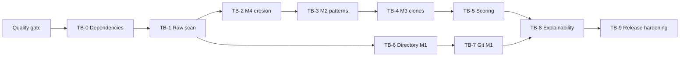

# Python Slop Detector Tasks

**Design**: `.specs/python-slop-detector/design.md`
**Status**: In Progress

> [!NOTE]
> After TB-3 passes its gate, read the user's
> [output and CLI direction](https://chatgpt.com/share/6aacd885-7c24-83e8-bc3c-aaf72a1c65f3).
> Update the remaining output and command plan before starting another tracer bullet.

## Delivery Strategy

Implementation proceeds through production tracer bullets. Each bullet adds one
runnable end-to-end capability through the API, core pipeline, report model, JSON,
and terminal interface. A bullet must pass its validation gate before work begins on
the next bullet.

Current checkpoint: Q01-Q07 and T01-T37 are complete through TB-3. The raw scan
reports pattern findings, M2, callable evidence, and M4 through the CLI and public API. Comparison has a
public entry point that explicitly raises `NotImplementedError` until TB-6. The retained learning tests
record the external behavior that production adapters rely on.

The TB-1 raw-scan slice passed these end-to-end checks:

- [x] T06: Immutable snapshot and comparison request unions.
- [x] T07: Diagnostics, coverage, exact file SLOC evidence, and language evidence.
- [x] T08: Measured and unavailable metrics with validated ratio arithmetic.
- [x] T10: Immutable configuration with tested file and CLI precedence.
- [x] T09: Report envelope, provenance, cohorts, and analysis variants.
- [x] T11: Read-only adapter protocol with owned evidence and capability declarations.
- [x] T12: Explicit registration with stable routing metadata and atomic validation.
- [x] T13-T15: Source inventory, exact Python SLOC, and the Python adapter.
- [x] T16-T22: Aggregation, orchestration, public API, JSON, terminal, and CLI scan.
- [x] Validate 398 deterministic tests and 24 separate dependency learning tests.
- [x] Ruff format/lint, Pyright, four import-linter contracts, dependency audit,
  package build, and CLI smoke checks pass.
- [x] Coverage is 97.90 percent with branch measurement enabled; CI enforces 90 percent.

TB-2 passes its validation gate:

- [x] T23-T24: Owned callable evidence, explicit function-analysis outcomes, and exact M4 mass.
- [x] T25-T27: File and cohort M4, deterministic JSON, terminal evidence, and golden fixtures.
- [x] Complexity failures preserve SLOC and successful file results. Strict scans detect them.
- [x] Custom adapters produce stable callable order regardless of emission order.
- [x] 460 deterministic tests and 30 separate learning tests pass. Coverage is 97.97 percent.
- [x] Ruff, Pyright, four import contracts, dependency audit, package build, and CLI checks pass.

The independent test author wrote the domain, extractor, and report contracts before
implementation. Three final checks for configuration, hotspot ranking, and cohort
isolation used blind test-after review. The ordering regression failed before its fix.

TB-3 passes its validation gate:

- [x] T28-T33: Validated rule metadata, explicit pattern outcomes, and twenty Python rules.
- [x] T34-T37: Union-based file and cohort M2, versioned findings, and terminal/JSON evidence.
- [x] Independent positive and keep-case tests cover each rule. Review regressions cover
  format specifications, generic bindings, indirect helper calls, and type comments.
- [x] Unknown rule IDs are configuration errors. Pattern failures preserve M4 and valid files.
- [x] 633 deterministic tests and 30 retained learning tests pass. Coverage is 97.72 percent.
- [x] Ruff, Pyright, four import contracts, dependency audit, builds, and CLI checks pass.

The malformed basic fixture is excluded from lint/type checks and normal test
collection. Its source remains directly scannable with `slop scan tests/fixtures/basic`.
The normal test command excludes learning tests. Architecture tests inject each of
the 16 forbidden dependency directions into isolated package copies.

Language evidence accepts only empty clone collections until their owned contract
exists. TB-2 and TB-3 add explicit per-file function and pattern outcomes.
File SLOC counts are checked immutable projections of exact line
identities. Metric values are immutable calculation projections with ratio inputs
checked at construction.

The report contracts now resolve the decisions required before aggregation:

- [x] Report-owned diagnostic wrappers have unique IDs and source-state ownership.
  Nested metrics resolve links within their source state. Comparison-level metrics
  can refer to either input's diagnostic.
- [x] Snapshot scores use measured and unavailable variants with closed reasons.
- [x] The `unsupported-capability` metric reason distinguishes missing evidence
  support from a failed analyzer.

Before the next implementation slice, review the linked output and CLI direction.
The existing sequence puts TB-4 clone detection next, subject to that revision.
TB-2 retains Radon learning tests for AST traversal and complete callable spans.
The scoring package's import-linter source contract must be added when that package
exists. M1, M3, and calibrated snapshot scores remain explicitly unavailable.

The dependency graph keeps M1 work independent from M2-M4 after the first working
scan. The quality gate is established before dependency characterization. Calibration
begins only after all snapshot metrics are stable:



## Tracer Bullets

### TB-0: Characterize external dependencies

**Question answered:** Do Radon, Tree-sitter, and Git expose the behavior that the
approved design assumes?

**Layers touched:** Isolated dependency tests only.

**Scope:** Pin dependency versions and record observed behavior for nested functions,
syntax normalization, parse errors, revision reads, and rename metadata.

**Not included:** Production adapters or user-facing commands.

**Validation:**

- [x] Each behavioral question has one focused executable test.
- [x] Observations are recorded in the test comments.
- [x] Design assumptions that do not hold are raised before dependent implementation.
- [x] Retain dependency tests as executable evidence, outside the normal suite.

**Dependencies:** None.

### TB-1: Scan one Python project

**Question answered:** Can the CLI and Python API scan the same directory and produce
the same deterministic report through the language-adapter boundary?

**Layers touched:** CLI and API to source discovery to Python adapter to aggregation to
JSON and terminal renderers.

**Scope:** Source inventory, production/test cohorts, Python SLOC, diagnostics, raw
coverage, and unavailable metric states.

**Not included:** M1-M4 values or normalized scores.

**Validation:**

- [x] `slop scan tests/fixtures/basic` completes successfully.
- [x] API and CLI JSON are equivalent. No invocation-only metadata is emitted yet.
- [x] A malformed file creates a diagnostic and does not stop the default scan.
- [x] Repeated scans produce byte-stable JSON for the same resolved source root.

**Dependencies:** TB-0.

### TB-2: Measure structural erosion

**Question answered:** Can third-party complexity evidence flow through the owned
models and produce exact file and project M4 values?

**Layers touched:** Radon wrapper to function evidence to erosion aggregation to report
and hotspot output.

**Scope:** Functions, methods, nested closures, callable SLOC, mass, CC threshold, M4,
and eroded-function evidence.

**Not included:** Pattern or clone verbosity.

**Validation:**

- [x] Golden fixtures produce exact callable spans, CC values, SLOC, and mass.
- [x] Class aggregate values do not double-count method complexity.
- [x] A file with no callables reports M4 as not applicable.
- [x] Project M4 derives from total project mass rather than average file ratios.

**Dependencies:** TB-1.

### TB-3: Measure pattern verbosity

**Question answered:** Can independently tested Python rules emit traceable spans and
produce union-based M2 values without double-counting lines?

**Layers touched:** Python AST rules to pattern engine to M2 aggregation to finding and
terminal views.

**Scope:** Rule metadata, suppression-ready findings, four initial rule families, line
union, M2, and evidence rendering.

**Not included:** User-authored rules or automatic fixes.

**Validation:**

- [x] Every rule has positive and negative fixtures.
- [x] The initial catalog contains at least twenty high-confidence rules.
- [x] Multiple findings on one line contribute one flagged SLOC.
- [x] Every finding includes a stable rule identifier and source span.

**Dependencies:** TB-2.

### TB-4: Measure structural clones

**Question answered:** Can structural duplicate candidates be normalized, grouped,
and converted into traceable M3 evidence across files?

**Layers touched:** Tree-sitter parser to candidate normalization to clone grouping to
M3 aggregation and combined verbosity.

**Scope:** Exact and consistently renamed clones, minimum thresholds, maximal useful
groups, M3, and M2/M3 source-line union.

**Not included:** Near-miss semantic clones or cross-language clone groups.

**Validation:**

- [ ] Formatting and comments do not break an otherwise equal clone.
- [ ] Tiny and signature-only matches do not create clone groups.
- [ ] Cross-file clone members appear under one stable group identifier.
- [ ] Overlapping groups never raise M3 or combined verbosity above one.

**Dependencies:** TB-3.

### TB-5: Score snapshots

**Question answered:** Can raw M2-M4 evidence produce reproducible file and project
scores through a versioned calibration profile?

**Layers touched:** Profile loader to compatibility checks to scorer to contribution
and hotspot renderers.

**Scope:** Synthetic scoring tests, calibration pipeline, human-code reference profile,
score bands, contributions, and top-five hotspots.

**Not included:** Change-pressure scoring until a task-delta corpus exists.

**Validation:**

- [ ] Contribution points sum exactly to the displayed score.
- [ ] M2 and M3 contribute only through combined verbosity.
- [ ] An incompatible profile yields raw metrics and score unavailable.
- [ ] Adding clean tiny files cannot reduce the project score by file averaging.
- [ ] The packaged profile records its corpus and metric versions.

**Dependencies:** TB-4.

### TB-6: Compare two directories

**Question answered:** Can the same snapshot pipeline compare two directory states and
produce exact M1 plus M2-M4 deltas?

**Layers touched:** Directory providers to file matching to line diff to comparison
report and terminal renderer.

**Scope:** Added, deleted, modified, exact-content renamed files, M1, raw metric deltas,
and largest regressions.

**Not included:** Git revisions or normalized M1 score.

**Validation:**

- [ ] Per-file M1 values reconcile with the project M1 value.
- [ ] Added and deleted SLOC use the shared language SLOC definition.
- [ ] Exact-content directory renames do not appear as full deletion and addition.
- [ ] Baseline and current M2-M4 use the same snapshot pipeline as `scan`.

**Dependencies:** TB-1. This bullet can proceed while TB-2 through TB-4 are in progress,
then add their deltas after each metric becomes stable.

### TB-7: Compare Git revisions

**Question answered:** Can Git objects be analyzed without changing the working tree and
produce the same comparison result as equivalent directories?

**Layers touched:** Git source provider to snapshot pipeline to Git rename mapping to
comparison report.

**Scope:** Working tree, commit, branch, and tag references with read-only Git access.

**Not included:** Remote fetches or automatic baseline selection.

**Validation:**

- [ ] Analysis does not modify the index or working tree.
- [ ] Equivalent Git and directory comparisons return the same M1-M4 values.
- [ ] Git rename metadata maps baseline and current file identities.
- [ ] Missing revisions produce exit code 2 and a direct error message.

**Dependencies:** TB-6.

### TB-8: Explain every result

**Question answered:** Can a user move from a score to all contributing evidence without
reading the complete JSON document?

**Layers touched:** Report query services to `inspect`, `findings`, and `rules` commands
to adaptive terminal renderers.

**Scope:** File detail, filtering, full rule inventory, score provenance, narrow terminal
behavior, and plain output.

**Not included:** HTML or SARIF.

**Validation:**

- [ ] Every contribution links to raw metrics and evidence.
- [ ] `slop inspect FILE` shows all findings and eroded callables for that file.
- [ ] `slop findings` filters by path, metric, rule, and severity.
- [ ] `NO_COLOR` and narrow terminals remain readable.

**Dependencies:** TB-5 and TB-7.

### TB-9: Release the Python MVP

**Question answered:** Is the system deterministic, portable, documented, and safe to
install as a Python package?

**Layers touched:** Complete product.

**Scope:** Contract tests, cross-platform behavior, performance baseline, packaging,
documentation, and release checks.

**Not included:** P2 metrics or TypeScript implementation.

**Validation:**

- [ ] All unit, contract, golden, and integration tests pass.
- [ ] Windows, macOS, and Linux CI jobs pass on supported Python versions.
- [ ] The 100-thousand-SLOC benchmark records time and peak memory.
- [ ] Wheel and source distribution install into clean environments.
- [ ] The README reproduces the snapshot and comparison examples.

**Dependencies:** TB-8.

## Atomic Task Breakdown

### Quality precursor: repository guardrails

The precursor adapts the common controls from `intelligent-claims` and `model-access`.
It does not copy repository-specific test style, internal indexes, or the untested
custom Pylint plugin.

| ID | Deliverable | Location | Depends on | Done when |
|---|---|---|---|---|
| Q01 | Record the use, adaptation, or rejection of each reference-repository quality control | `.specs/python-slop-detector/design.md` | None | The quality-guardrail table names every selected gate and explains the exclusions |
| Q02 | Configure uv groups, Ruff format and lint, Pyright, strict pytest behavior, and branch coverage | `pyproject.toml` | Q01 | Each configured command loads successfully and no two tools duplicate the same role |
| Q03 | Add repository ignore rules for generated Python, test, coverage, build, and tool-cache artifacts | `.gitignore` | Q02 | A quality run leaves the worktree free of new cache artifacts |
| Q04 | Lock dependencies and document the exact local quality commands | `uv.lock`, `README.md` | Q02-Q03 | A clean environment can sync with the lock and run the documented commands |
| Q05 | Add the first CI gate with locked sync, static checks, dependency audit, deterministic tests, package build, and CLI smoke test | `.github/workflows/ci.yml` | Q04 | CI commands are identical to documented local commands where platform permits |
| Q06 | Add import-linter contracts after the planned package boundaries exist | `pyproject.toml` | T12, T17 | Violating each dependency direction makes `lint-imports` fail in a contract test |
| Q07 | Enable and ratchet 90 percent branch coverage after the first vertical slice | `pyproject.toml`, `.github/workflows/ci.yml` | T22 | Coverage is measured in CI and new code cannot lower the threshold |

### Phase 0: Foundation and dependency evidence

| ID | Deliverable | Location | Depends on | Done when |
|---|---|---|---|---|
| T01 | Define Python 3.12 project metadata, runtime dependencies, development groups, and `slop` entry point | `pyproject.toml` | Q02 | `uv sync` creates a runnable environment, every base quality command loads, and `slop --help` resolves the entry point |
| T02 | Record Radon behavior for nested closures, methods, class aggregates, syntax errors, and end lines | `tests/learning/test_radon_behavior.py` | T01 | Each design assumption has an observed result and comment |
| T03 | Record Tree-sitter behavior for comments, docstrings, identifiers, literals, error nodes, and byte spans | `tests/learning/test_tree_sitter_behavior.py` | T01 | Candidate-normalization unknowns have observed results |
| T04 | Record Git behavior for object reads, working-tree content, ignored files, and rename detection | `tests/learning/test_git_behavior.py` | T01 | The Git provider contract is supported by observed commands |

The scaffold creates these files before the first commit:

```tree
pyproject.toml [new]
uv.lock [new]
src [new]
  slop_measure [new]
    __init__.py [new]
tests [new]
  learning [new]
```

### Phase 1: TB-1 raw scan

| ID | Deliverable | Location | Depends on | Done when |
|---|---|---|---|---|
| T05 | Define project paths, source identities, source references, documents, and cohorts | `src/slop_measure/domain/source.py` | T01 | Invalid absolute report paths and unknown cohorts fail validation |
| T06 | Define snapshot and comparison request tagged unions | `src/slop_measure/domain/requests.py` | T05, T10 | A snapshot cannot contain a baseline and a comparison requires two references |
| T07 | Define diagnostics, coverage, file evidence, and language evidence | `src/slop_measure/domain/evidence.py` | T05 | Adapter output validates without third-party parser objects |
| T08 | Define measured and unavailable metric variants | `src/slop_measure/domain/metrics.py` | T05 | Zero and unavailable remain distinct valid states |
| T09 | Define provenance, cohort report, snapshot analysis, comparison analysis, and report envelope | `src/slop_measure/domain/reports.py` | T06-T08 | JSON schema contains explicit discriminators |
| T10 | Define immutable configuration and load `pyproject.toml` or `slop.toml` | `src/slop_measure/config.py` | T05 | CLI overrides and config precedence have deterministic tests |
| T11 | Define `LanguageAdapter` and evidence-capability protocols | `src/slop_measure/languages/base.py` | T07 | A fake adapter type-checks against the protocol |
| T12 | Implement explicit language-adapter registration | `src/slop_measure/languages/registry.py` | T11 | Duplicate language IDs and extensions fail loudly |
| T13 | Inventory filesystem documents with exclusions, Git-ignore support, hashes, and normalized paths | `src/slop_measure/sources/filesystem.py` | T05, T10 | Fixture inventory matches its manifest on Windows-style and POSIX paths |
| T14 | Classify Python SLOC and return exact physical line identities | `src/slop_measure/languages/python/sloc.py` | T02, T05 | Blank, comment-only, and docstring-only fixtures are excluded |
| T15 | Parse Python once and emit file evidence through the adapter contract | `src/slop_measure/languages/python/adapter.py` | T07, T11-T14 | Valid and malformed fixtures return deterministic evidence and diagnostics |
| T16 | Aggregate source coverage by language and cohort | `src/slop_measure/metrics/aggregate.py` | T07-T09, T15 | Project totals reconcile with file evidence |
| T17 | Orchestrate one snapshot from request through report | `src/slop_measure/application/service.py` | T09, T12-T16 | Public service returns a valid `AnalysisReport` |
| T18 | Expose stable `scan` and `compare` Python functions | `src/slop_measure/api.py` | T17 | API callers do not import internal modules |
| T19 | Serialize byte-stable schema-versioned JSON | `src/slop_measure/reporting/json.py` | T09, T17 | Repeated normalized output is byte-identical |
| T20 | Render the raw snapshot header and coverage sections | `src/slop_measure/reporting/terminal.py` | T09, T17 | Interactive and plain output match approved golden text |
| T21 | Implement `slop scan` with JSON, strict, scope, and no-color options | `src/slop_measure/cli.py` | T18-T20 | CLI and API reports are equivalent |
| T22 | Add the end-to-end basic project fixture and golden outputs | `tests/golden/test_scan_basic.py` | T21 | All TB-1 validation items pass |

### Phase 2: TB-2 structural erosion

| ID | Deliverable | Location | Depends on | Done when |
|---|---|---|---|---|
| T23 | Convert Radon functions, methods, and closures into owned function evidence | `src/slop_measure/languages/python/complexity.py` | T02, T14-T15 | Callable fixtures match the learned Radon behavior |
| T24 | Compute function mass and file/project erosion | `src/slop_measure/metrics/erosion.py` | T08, T23 | Formula, threshold, empty denominator, and aggregation tests pass |
| T25 | Add M4 and eroded-callable evidence to snapshot aggregation | `src/slop_measure/metrics/aggregate.py` | T16, T24 | File and project reports carry raw M4 inputs |
| T26 | Render M4 summary and complexity hotspots | `src/slop_measure/reporting/terminal.py` | T20, T25 | Output shows mass, counts, threshold, and source spans |
| T27 | Add exact M4 fixture manifests and golden reports | `tests/golden/test_erosion.py` | T26 | All TB-2 validation items pass |

### Phase 3: TB-3 pattern verbosity

| ID | Deliverable | Location | Depends on | Done when |
|---|---|---|---|---|
| T28 | Define rule metadata, rule result, project context, and Python rule protocol | `src/slop_measure/languages/python/patterns.py` | T07, T15 | Duplicate IDs and invalid spans fail validation |
| T29 | Add at least five high-confidence redundant-expression rules with fixtures | `src/slop_measure/languages/python/rules/redundancy.py` | T28 | Positive and negative cases pass for every rule |
| T30 | Add at least five high-confidence control-flow rules with fixtures | `src/slop_measure/languages/python/rules/control_flow.py` | T28 | Positive and negative cases pass for every rule |
| T31 | Add at least five high-confidence defensive-code rules with fixtures | `src/slop_measure/languages/python/rules/defensive.py` | T28 | Boundary cases prevent known false positives |
| T32 | Add at least five high-confidence abstraction rules with fixtures | `src/slop_measure/languages/python/rules/abstraction.py` | T28 | Trivial wrappers and helpers have explicit keep cases |
| T33 | Register and execute the versioned Python rule catalog | `src/slop_measure/languages/python/rules/__init__.py` | T29-T32 | Catalog order and version are stable |
| T34 | Compute file/project M2 from unique pattern SLOC | `src/slop_measure/metrics/verbosity.py` | T08, T14, T33 | Overlapping findings count each source line once |
| T35 | Add pattern evidence and M2 to the adapter and report pipeline | `src/slop_measure/languages/python/adapter.py` | T15, T33-T34 | Findings preserve rule and source provenance |
| T36 | Render M2 totals and top pattern findings | `src/slop_measure/reporting/terminal.py` | T26, T35 | Summary and evidence match the approved structure |
| T37 | Add exact M2 fixture manifests and golden reports | `tests/golden/test_patterns.py` | T36 | All TB-3 validation items pass |

### Phase 4: TB-4 structural clones

| ID | Deliverable | Location | Depends on | Done when |
|---|---|---|---|---|
| T38 | Parse Python with Tree-sitter and emit versioned normalized tokens | `src/slop_measure/languages/python/parsing.py` | T03, T15 | Formatting and trivia normalization tests pass |
| T39 | Extract eligible statement-block clone candidates | `src/slop_measure/languages/python/clones.py` | T14, T38 | Threshold and exclusion fixtures pass |
| T40 | Group candidate hashes and collapse contained duplicate groups | `src/slop_measure/metrics/clones.py` | T39 | Stable IDs and maximal-group tests pass |
| T41 | Compute M3 and combined M2/M3 verbosity unions | `src/slop_measure/metrics/verbosity.py` | T34, T40 | Ratios stay within zero and one under overlap |
| T42 | Add clone groups and combined verbosity to report aggregation | `src/slop_measure/metrics/aggregate.py` | T25, T35, T41 | Project totals reconcile with clone members |
| T43 | Render M3, combined verbosity, and top clone groups | `src/slop_measure/reporting/terminal.py` | T36, T42 | Default output remains concise and traceable |
| T44 | Add exact clone fixture manifests and golden reports | `tests/golden/test_clones.py` | T43 | All TB-4 validation items pass |

### Phase 5: TB-5 scoring and calibration

| ID | Deliverable | Location | Depends on | Done when |
|---|---|---|---|---|
| T45 | Define calibration populations, score models, bands, and compatibility fields | `src/slop_measure/domain/scoring.py` | T08-T09 | Invalid weights and incompatible metric sets fail validation |
| T46 | Load and verify packaged calibration profiles | `src/slop_measure/scoring/profiles.py` | T45 | Schema, corpus hash, and metric versions are checked |
| T47 | Transform raw values and compute exact contribution points | `src/slop_measure/scoring/engine.py` | T42, T45-T46 | Synthetic profile tests cover boundaries and missing metrics |
| T48 | Rank file hotspots without affecting project aggregation | `src/slop_measure/scoring/hotspots.py` | T47 | Stable tie-breaking and top-N tests pass |
| T49 | Define the maintained Python calibration corpus manifest | `calibration/python/corpus.toml` | T44 | Each repository has a revision, license, cohort, and exclusion policy |
| T50 | Analyze a local corpus and build candidate profile distributions | `tools/calibrate.py` | T46-T49 | Repeated input produces byte-stable candidate profiles |
| T51 | Review corpus results and package the first approved profile | `src/slop_measure/scoring/resources/py-2026.1.json` | T50 | Profile provenance and reference distributions are complete |
| T52 | Render score, band, contributions, profile version, and hotspots | `src/slop_measure/reporting/terminal.py` | T43, T47-T48, T51 | Contributions sum to the headline score |
| T53 | Add calibrated file/project golden reports | `tests/golden/test_scoring.py` | T52 | All TB-5 validation items pass |

> [!WARNING]
> T49-T51 require an approved public-repository corpus and network access to obtain
> pinned revisions. Do not generate a profile from convenient local projects and call
> it a human-code baseline.

### Phase 6: TB-6 and TB-7 comparisons

| ID | Deliverable | Location | Depends on | Done when |
|---|---|---|---|---|
| T54 | Define file-change variants and comparison metric deltas | `src/slop_measure/domain/changes.py` | T05-T09 | Added, deleted, modified, renamed, and unchanged states are exhaustive |
| T55 | Match directory files by path and exact-content rename identity | `src/slop_measure/sources/compare.py` | T13, T54 | Directory fixture mappings are exact |
| T56 | Diff physical lines and count added/deleted SLOC from both SLOC sets | `src/slop_measure/metrics/loc_delta.py` | T14, T54-T55 | Per-file and project M1 reconcile |
| T57 | Orchestrate two directory snapshots and derive deltas | `src/slop_measure/application/service.py` | T17, T42, T54-T56 | Comparison reuses snapshot analysis for M2-M4 |
| T58 | Render comparison summary, M1, metric movement, and regressions | `src/slop_measure/reporting/terminal.py` | T52, T57 | Better and worse labels do not depend on color |
| T59 | Implement directory mode for `slop diff` | `src/slop_measure/cli.py` | T21, T57-T58 | Approved directory comparison command works |
| T60 | Add directory comparison fixtures and golden reports | `tests/golden/test_diff_directories.py` | T59 | All TB-6 validation items pass |
| T61 | Read repository inventory and file bytes from Git revisions without checkout | `src/slop_measure/sources/git.py` | T04, T05, T10 | Branch, tag, commit, and working-tree fixtures work |
| T62 | Apply Git rename metadata to comparison file identities | `src/slop_measure/sources/git.py` | T54-T55, T61 | Renames do not become unrelated delete/add pairs |
| T63 | Add Git revision routing to `slop diff` | `src/slop_measure/cli.py` | T59, T61-T62 | Git and directory modes share the same comparison renderer |
| T64 | Add read-only Git integration tests and equivalent-directory assertions | `tests/integration/test_git_comparison.py` | T63 | All TB-7 validation items pass and worktree status stays unchanged |

### Phase 7: TB-8 explainability

| ID | Deliverable | Location | Depends on | Done when |
|---|---|---|---|---|
| T65 | Query one file's metrics, functions, patterns, clones, and deltas | `src/slop_measure/reporting/queries.py` | T53, T64 | File query returns every contributing evidence record |
| T66 | Implement the `slop inspect` file-detail view | `src/slop_measure/cli.py` | T65 | Snapshot and comparison file views match approved output |
| T67 | Implement filterable `slop findings` output | `src/slop_measure/cli.py` | T65 | Path, metric, rule, and severity filters compose |
| T68 | Implement versioned `slop rules` catalog output | `src/slop_measure/cli.py` | T33 | Enabled state and catalog version are visible |
| T69 | Add width-aware, no-color, and ASCII terminal behavior | `src/slop_measure/reporting/terminal.py` | T52, T58, T66-T68 | Narrow and redirected golden outputs remain readable |
| T70 | Add explainability command golden tests | `tests/golden/test_explainability.py` | T69 | All TB-8 validation items pass |

### Phase 8: TB-9 release hardening

| ID | Deliverable | Location | Depends on | Done when |
|---|---|---|---|---|
| T71 | Centralize public error types and CLI exit-code mapping | `src/slop_measure/errors.py` | T64, T70 | Every documented failure has one stable code and message |
| T72 | Prove core language neutrality with a fake adapter contract suite | `tests/contract/test_language_adapter.py` | T11-T12, T53 | Fake evidence reaches both renderers without core language branches |
| T73 | Add cross-platform path and stable-ordering tests | `tests/contract/test_determinism.py` | T69 | Windows and POSIX expectations produce identical report paths |
| T74 | Add the 100-thousand-SLOC time and peak-memory benchmark | `tests/performance/test_large_project.py` | T70 | A reproducible baseline report is recorded |
| T75 | Expand CI to Windows, macOS, and Linux release jobs | `.github/workflows/ci.yml` | Q05, T71-T74 | All supported jobs run locked installs, deterministic tests, package installation, and CLI smoke checks |
| T76 | Document installation, configuration, metrics, scoring, commands, and limitations | `README.md` | T70-T75 | A clean environment reproduces scan and diff examples |
| T77 | Build and install wheel and source distribution in clean environments | `tests/integration/test_distribution.py` | T01, T76 | Both artifacts expose the `slop` command and importable API |
| T78 | Run the complete release validation and record retained learning tests | Repository-wide | T71-T77 | Every TB-9 validation item passes and learning-test disposition is explicit |

## Execution Order and Parallel Work

Work remains sequential at tracer-bullet boundaries. Within a bullet, only tasks that
do not edit the same file can run in parallel:

```text
quality precursor
  Q01 -> Q02 -> Q03 -> Q04 -> Q05
  Q06 follows T12 and T17
  Q07 follows T22

TB-0
  T01 → T02, T03, T04

TB-1
  T05 → T06, T07, T08
  T06, T07, T08 → T09, T10, T11
  T11 → T12
  T05, T10 → T13, T14
  T07, T11, T12, T13, T14 → T15 → T16 → T17 → T18
  T09, T17 → T19, T20 → T21 → T22

TB-2 through TB-5
  Complete and validate each bullet before starting the next.

TB-6
  May start after TB-1. Reconcile M2-M4 deltas after TB-4.

TB-7 through TB-9
  Sequential by bullet. Parallelize isolated golden, contract, and platform tests only
  when their source contracts are already stable.
```

## Tools and Skills for Execution

| Work type | Tools | Recommended skill |
|---|---|---|
| Project and source edits | `apply_patch` and PowerShell checks | None for pure scaffolding |
| Domain and config models | `apply_patch`, type checker, pytest | `data-structure-design` |
| External dependency characterization | pytest in `tests/learning` | `learning-tests` if separate-agent work is authorized |
| Metric and scoring algorithms | pytest then implementation | `tdd` if separate test-author work is authorized |
| CLI text, errors, and README | golden tests and `apply_patch` | `ste` |
| Current dependency behavior | Official documentation and isolated executable tests | `learning-tests` if authorized |

No MCP application is required for the MVP. Network access is required for dependency
installation, dependency audits, and the approved calibration corpus. Follow the
active session permissions. Full-access sessions need no routine approval prompts.

## Completion Definition

- [ ] Every P1 acceptance criterion in the approved specification maps to a passing
      automated test.
- [ ] Ruff format, Ruff lint, Pyright, import-linter, dependency audit, and branch
      coverage gates pass from the locked environment.
- [ ] Every tracer bullet passes before the next bullet starts.
- [ ] File and project raw totals reconcile where the metric is additive.
- [ ] Every score names its compatible calibration and rule versions.
- [ ] Every terminal number is traceable to JSON evidence.
- [ ] The Python MVP installs from a wheel and exposes both the CLI and API.
- [ ] The fake-adapter contract proves that TypeScript can be added without changing
      the report or scoring core.
